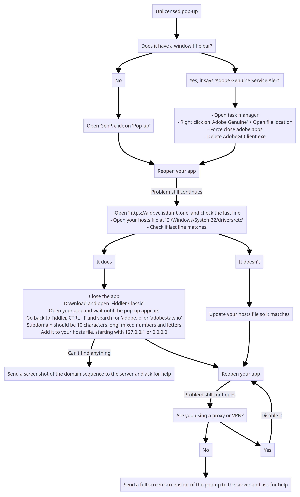

# abobe

::: tip ‎ 

:::


## Monkrus


::: info ‎ 
Monkrus is a cool Russian dude and you can find his treatments [here](https://w14.monkrus.ws/).
:::

1. Open https://w14.monkrus.ws/ in your browser, scroll down until you see a search bar, search for the name of the software you're interested in and click enter.
2. Ctrl+f the page and search for `Сортировать по дате`, click on this so that it is sorted by date, so that you get the latest version of the software.
3. Once on the software page, scroll down to the list of links of torrents, `UNIONDHT.ORG` is recommended.
4. Now download the torrent, it's best to always go with magnet links when downloading torrents, so look for the `🧲` icon and click on that so that it is automatically added to your torrent client.
5. When the torrent finished downloading, run or extract the `.iso` file and then run `autoplay.exe`, and that's it!

::: tip
  Read through the comments on the page of the software you are downloading, a lot of the time people provide solutions you didn't know you were going to need.
:::


## GenP


### info

```fix
- IMPORTANT INFORMATION, STOP ASKING AND READ -
```

> 🔗 **For the Braindead in the Server**
> *- Screenshot of the menus for those braindead*
>
> https://imgur.com/a/OMVqu70

> 🔗 **New Folks MUST READ**
> *- If nothing else, you need to read this!*
>
> [Friendly Reminder to new folks.](https://www.reddit.com/r/GenP/comments/qpcnob/friendly_reminder_to_new_folks/)

> 🔗 **FAQ**
> *- Brief overview of everything.*
>
> [wiki/faq](https://www.reddit.com/r/GenP/wiki/faq)

> 🔗 **Patching Methods**
> *- Brief explanation of what each Patching Method does.*
> *- Currently CC+GenP and M0nkrus.*
>
> [patchmethods](https://www.reddit.com/r/GenP/wiki/patchmethods)

> 🔗 **Guides + Links + Guides**
> *- Creative Cloud (CC)*,
> *GenP*,
> *Monkrus Collection / Individual Apps*,
> *HomeScreenFix (Thanks u/OneG36)*,
> *CCStopper (Thanks E-Soda)*&
> *Many others.*
>
> [redditgenpguides](https://www.reddit.com/r/GenP/wiki/redditgenpguides)

> 🔗 **Common Questions**
> *- Most of the same repeating questions*
>
> [commonquestions](https://www.reddit.com/r/GenP/wiki/commonquestions)

**You'll probably find the answer in one of those.**


### guides reddit updated

**With the intention of keeping all guides equal, we're stopping "guides from discord" due to character limitation, and simply having the links to redirect to the appropriate guides on r/GenP Reddit.**

*Easier for us to update overall, and easier for everyone to find the same guides with the same information*

——————————

**For the blind, pictures:**
https://imgur.com/a/OMVqu70

```fix
☠️ ALL INFO / FILES CAN BE FOUND IN THE WIKI - EXPLORE IT YOU SLOTHS!
```
https://www.reddit.com/r/GenP/wiki/index/

**| | | START OF GUIDES ON REDDIT | | |**

```fix
Guide #1 - How to whitelist a file from windows defender
```
> https://www.reddit.com/r/GenP/wiki/redditgenpguides/#wiki_.25BA_guide_.231_-_how_to_whitelist_files

```fix
🤡 Guide #2 - Dummy Guide for First Timers CC+GenP (Step-by-Step) - DEFAULT
```
> https://www.reddit.com/r/GenP/wiki/redditgenpguides/#wiki_.1F921_guide_.232_-_dummy_guide_for_first_timers_genp_.28cc_.2B_genp.29

```fix
(...) CC-Toolbox Troubleshoot
```
> https://www.reddit.com/r/GenP/wiki/redditgenpguides/#wiki_.28....29_cc-toolbox_troubleshoot

```fix
☢️ Guide #4 - NOTHING IS WORKING / FULL CLEANING
```
> https://www.reddit.com/r/GenP/wiki/redditgenpguides/#wiki_.2622.FE0F_guide_.234_-_nothing_is_working_.2F_full_cleaning

```fix
🐒 Guide #7 - Monkrus Individual Apps (Step-by-Step) - EASIEST
```
> https://www.reddit.com/r/GenP/wiki/redditgenpguides/#wiki_.1F412_guide_.237_-_monkrus_individual_.28easiest_method.29

```fix
Guide #8 - Blocking unnecessary Adobe Background processes (Photoshop/Acrobar DC)
```
> https://www.reddit.com/r/GenP/wiki/redditgenpguides/#wiki_.25BA_guide_.238_-_blocking_unnecessary_adobe_background_processes.28ps.2Fdc.29

```fix
Guide #9 - Fix Neutral filters not available in Photoshop
```
> https://www.reddit.com/r/GenP/wiki/redditgenpguides/#wiki_.25BA_guide_.239_-_fix_neural_filters_not_available_in_photoshop

```fix
Guide #10 - ACROPOLIS: ADOBE ACROBAT PRO DC (Standalone/CC-less)
```
> https://www.reddit.com/r/GenP/wiki/redditgenpguides/#wiki_.1F4D1_guide_.2310_-_acropolis.3A_adobe_acrobat_pro_dc_.28standalone.2Fcc-less.29

```fix
(...) TROUBLESHOOT SECTION | UNLICENSED POPUP
```
> https://www.reddit.com/r/GenP/wiki/redditgenpguides/#wiki_.28....29_troubleshoot_section_.7C_unlicensed_popup

```fix
🛡️ If you are having "Unlicensed popups | App will be disabled | Not loading or looping CC
```
> https://www.reddit.com/r/GenP/wiki/redditgenpguides/#wiki_.28....29_troubleshoot_section_.7C_unlicensed_popup


### tips and guides

---

**"Loading Creative Cloud" loop**

If your Creative Cloud app isn't showing any updates or stuck in a "Loading Creative Cloud" loop (especially after reinstalling it), That might be caused by CCStopper that you might have used to disable the checkout pop up banner when you try to install any CC app. The fix for that is pretty simple, you just need to go to the firewall "Outbound Rules" option and remove or disable the CCStopper Rule.

---

Generative fill greyed out? --> Log back into your account/Verify your email address

---

Use the following two commands in PowerShell (admin) if your apps are warning you of unlicensed or non-genuine usage.

```powershell
  Add-Content -Path $env:windir\System32\drivers\etc\hosts -Value "`n0.0.0.0`t7g2gzgk9g1.adobe.io" -Force
```

```powershell
  Add-Content -Path $env:windir\System32\drivers\etc\hosts -Value "`n0.0.0.0`tic.adobe.io" -Force
```

If you prefer to do this manually, you can add the following two lines to the system hosts file (located in C:\Windows\System32\drivers\etc) using a text editor of your choice—

> 0.0.0.0 7g2gzgk9g1.adobe.io
>
> 0.0.0.0 ic.adobe.io

---

**How to Uninstall AGS - Adobe Genuine Service**

Open PowerShell, as admin, and enter:

```powershell
[System.Diagnostics.Process]::Start("C:\Program Files (x86)\Common Files\Adobe\AdobeGCClient\AdobeCleanUpUtility.exe")
```
and follow the on-screen instructions.

If that directory is absent then the service won’t be installed.

---

**FIX Creative Cloud not loading**

> **Resetting Hosts File:**
> 1. Open Notepad as Administrator:
>    - Right-click on the Notepad application and select *Run as administrator.*
> 
> 2. Open Hosts File:
>    - In Notepad, go to *File -> Open* and navigate to `C:\Windows\System32\drivers\etc`.
>   - Change the file type filter to *All Files,* then open the `hosts` file.
> 
> 3. Edit Hosts File:
>    - Remove any custom entries you added. Ensure that the file only contains default entries.
> 
> 4. Save Changes:
>    - Save the changes to the hosts file.
>
> **Removing Firewall Rules:**
> 1. Open Windows Defender Firewall:
>    - Go to *Control Panel -> System and Security -> Windows Defender Firewall.*
> 
> 2. Restore Default Settings:
>    - In the left pane, click on *Restore defaults* or *Restore Default Policy* to revert to the default firewall settings.

---

**Unlicensed POP UP Fix**



---

**ENJOY!**

